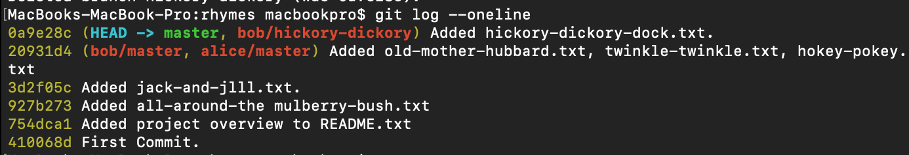
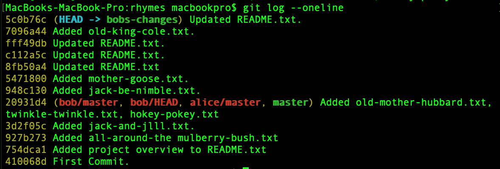

# **HASIL PRAKTIK 01**

## ***Collaborative development with Git***

ALICE : 

> Hasil akhir **git log --oneline**
>>
>

BOB :
> Hasil akhir **git log--oneline**
>>
>
> Proses pada bob berakhir pada proses sebelum rebase, karena untuk **Added hickory-dickory-dock.txt** pada *branch bob-changes* tidak ditemukan, namun **Added hickory-dickory-dock.txt** ditemukan di ALICE log 
