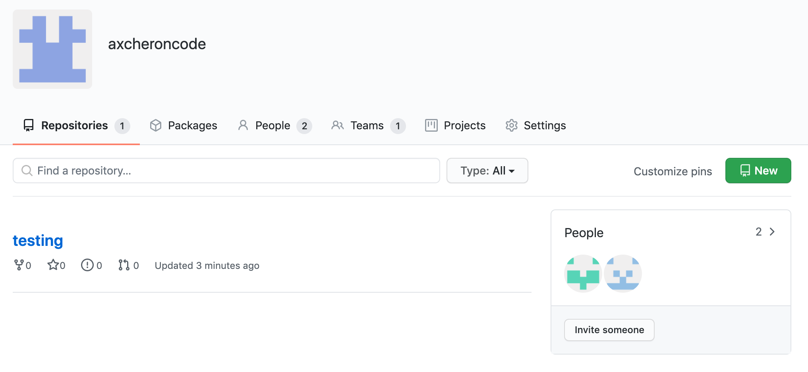
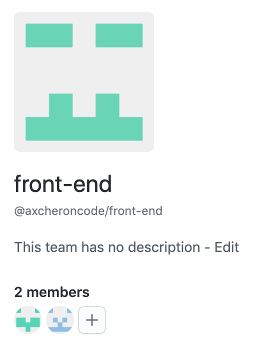
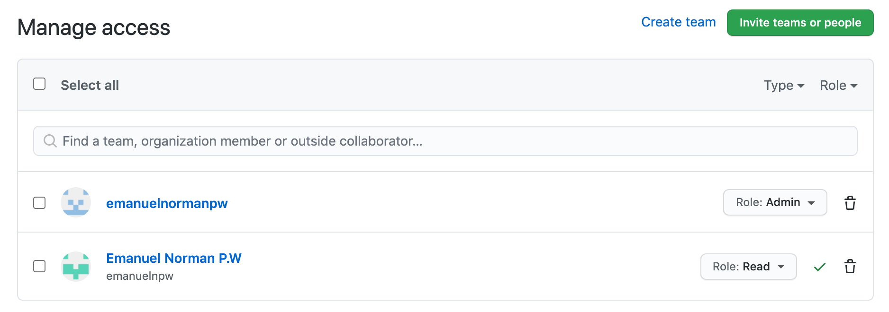
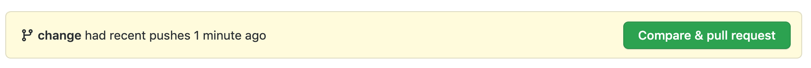
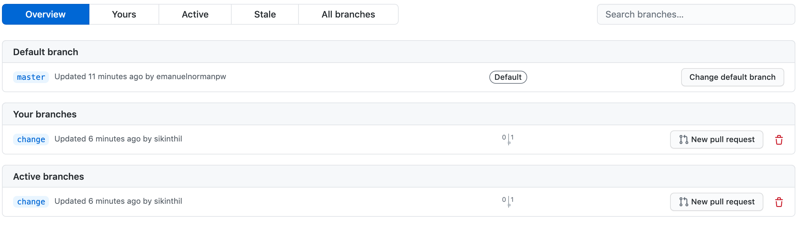
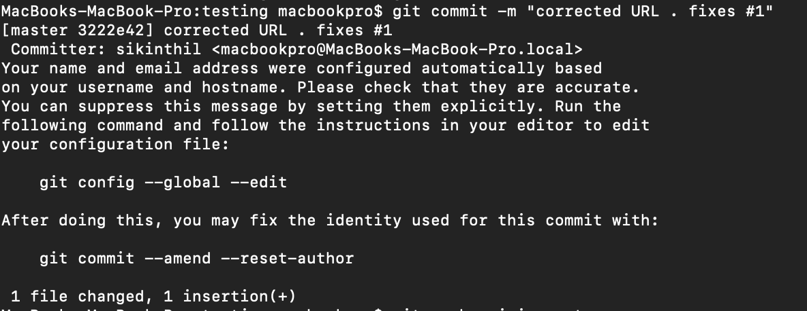
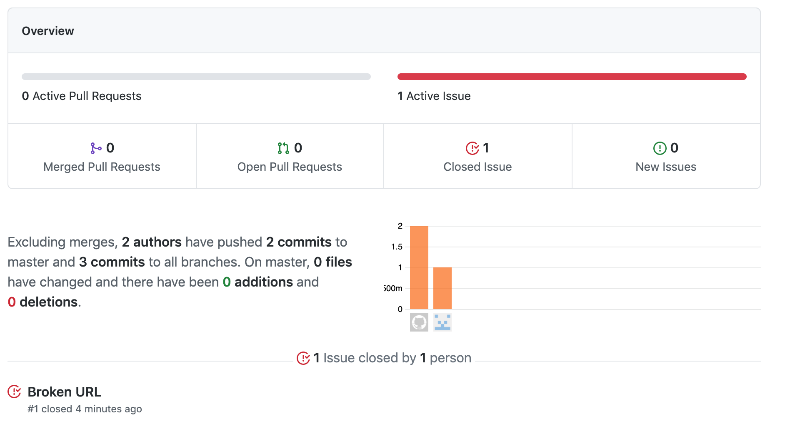
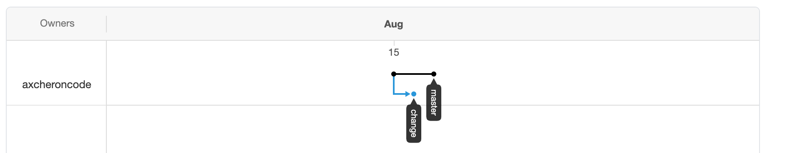

# **HASIL PRAKTIK 02**

## ***Team Collaboration With GitHub***

### **TOOL 01**

> CREATE ORGANIZATION
>>
> 
>>
> CREATE TEAM
> 
>>
> ROLE TEAM
>>
> 

### **TOOL 02**

> BRANCH
>>
> 
>>
> FORK NOTIF +1
> 
>>
> PULL REQUEST NOTIF
>>
> 
>>
> HISTORY
>>
> 

### **TOOL 03**

> ISSUE
>>
> 
>>
> ISSUE FIXED
>>
> 
>>
> ISSUE CLOSED
>>
> 

### **TOOL 04**

> OVERVIEW
>>
> 
>>
> NETWORK
>>
> 
